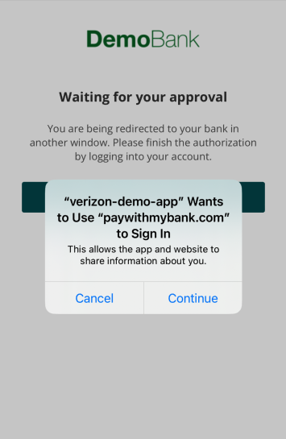

# About this demo

The purpose of this app demo is to demonstrate how to implement the OAuth login flow in iOS apps.


**IMPORTANT:**

 `SFSafari` is not allowed to call a deep link, in other words, the code bellow will not work, unless you utilize the `SFAuthenticationSession` or `ASWebAuthenticationSession` classes, based on the supported iOS version.

```javascript
    window.location.href = "myapp://"
```

One of the parameters that we need in establish data is the `urlScheme`, this parameter is mandatory to help in the navigation.

The `urlScheme` is a required parameter of the `ASWebAuthenticationSession` method. When the authentication process is completed, the `ASWebAuthenticationSession` component will utilize the `urlScheme` to manage the InAppBrowser screen.
In the `App-to-App` user flow where the user is redirected to a bank's mobile app for authentication, the `urlScheme` will be used as the target upon redirect back to your application. In this case, the `AppDelegate` or `SceneDelegate` files in your iOS application will handle the behavior upon redirect.


## AppDelegate vs SceneDelegate

SceneDelegate was introduced with iOS 13. The SceneDelegate will be responsible for what is shown on the screen (Windows or Scenes). It will also handle and manage the way your app is displayed to the user.

If your application was created before iOS 13 and was not updated to use the SceneDelegate, in this case all functions that will handle with `DeepLinks` or `urlScheme` should be implemented in AppDelegate file.

## Introduction

We have two solutions to implement a better experience when the app needs to open a new browser window to complete the OAuth login flow.

- SFAuthenticationSession for **iOS 9 until 12**
- ASWebAuthenticationSession for **iOS 13 or higher**


### SFAuthenticationSession

This solution will work only for iOS version between 9 and 12.

```swift
    let session = SFAuthenticationSession(url: url, callbackURLScheme: calbackURL, completionHandler: { (url, error) in
        //TODO: add your custom behavior here
    })

    session.start()
```


### ASWebAuthenticationSession

This solution will work for iOS version 13 and higher.

First step, you need to import the `AuthenticationServices`.

```swift
    import AuthenticationServices
```

After that will be necessary extends the `ASWebAuthenticationPresentationContextProviding` in your controller.

```swift
    extension ViewController: ASWebAuthenticationPresentationContextProviding {
        func presentationAnchor(for session: ASWebAuthenticationSession) -> ASPresentationAnchor {
            return ASPresentationAnchor()
        }
    }
```

And finally, you can implement the method to create the OAuth behavior.

```swift
    let webSession = ASWebAuthenticationSession(url: url, callbackURLScheme: calbackURL, completionHandler: { (url, error) in
            //TODO: add your custom behavior here
        })
    
    webSession.prefersEphemeralWebBrowserSession = true
    webSession.presentationContextProvider = self
    webSession.start()
```

**IMPORTANT:**

The attribute `prefersEphemeralWebBrowserSession` controls if the `ASWebAuthenticationSession` will show the authorization alert or not.


